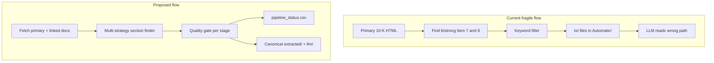

# URAP Pipeline Redesign Plan

## Problem summary

Three blockers prevent building a reliable company-year restructuring dataset:

1. **Item 7/8 extraction fails often** — current parser only searches `<b>`/`<strong>` tags in the primary HTML doc ([`src/items.py`](src/items.py)). Item 8 frequently links to a separate exhibit page; there is an unfinished comment at line 150 but no implementation. Failures show up as `missing_item_sections` in [`data/error_log/run_history.jsonl`](data/error_log/run_history.jsonl) and empty outputs like `2002_item7.txt` (header only).

2. **No efficient validation** — manual ground truth exists in [`data/testing_data/Manual/5_sample/`](data/testing_data/Manual/5_sample/) (docx + csv) but [`testing/performance/compare_restructure.py`](testing/performance/compare_restructure.py) uses wrong paths/gvkeys and [`compare_llm.py`](testing/performance/compare_llm.py) is a stub. There is no automated quality scoring or review queue.

3. **Fragmented data layout** — extraction writes to `Automatic/item7_restructuring/` but LLM reads from `testing_data/item7/` ([`LLM/main.py`](LLM/main.py) lines 12–13). JSONL, error logs, and CSV outputs are scattered. Failed extractions still write files and are treated as "done" on resume ([`src/main.py`](src/main.py) lines 107–126).



---

## Phase 1: Robust Item 7/8 extraction (highest priority)

**Target files:** [`src/items.py`](src/items.py), [`src/filing.py`](src/filing.py), [`src/main.py`](src/main.py)

### 1a. Multi-strategy section finder

Replace the single `<b>`/`<strong>` approach with a scorer that tries multiple strategies and picks the best candidate by content length:

- **Strategy A (keep):** bold/strong tags, skip TOC parents (current logic)
- **Strategy B (new):** anchor `id` / `name` attributes (e.g. `#item7`, fragment URLs like in manual sample URLs)
- **Strategy C (new):** broader heading scan on `<div>`, `<span>`, `<p>` with Item regex
- **Strategy D (new):** full-document text boundary search between "Item 7" and "Item 7A"/"Item 8" markers

Return metadata: `found_via`, `block_count`, `char_count` per item.

### 1b. Item 8 link resolution

When Item 8 content is short (< configurable threshold, e.g. 500 chars) or the heading contains an `<a href>`:

1. Resolve relative URL against filing base URL from [`src/filing.py`](src/filing.py) `FilingMeta.url`
2. Fetch linked HTML via existing `request_web()`
3. Re-run section finder on linked doc
4. Optionally parse filing index (`{accession}-index.htm`) to discover financial-statement exhibits when no inline link exists

Store which document Item 8 came from (`item8_source_doc`).

### 1c. Fix empty-output resume bug

In [`src/main.py`](src/main.py): only write output files and mark as skippable when `item7_blocks_count > 0 OR item8_blocks_count > 0` (and optionally when restructuring hits > 0). Failed extractions should remain retryable.

### 1d. Tests with real fixtures

Expand [`testing/Unittests/test_items.py`](testing/Unittests/test_items.py) with:
- Item 8 redirect fixture (short heading + linked page with content)
- TOC vs real section fixture (already partially covered)
- Empty/old filing fixture matching CIK `0000005272` failure pattern

Benchmark pass criteria: **≥4 of 5 manual sample companies** have non-empty Item 7/8 sections after extraction.

---

## Phase 2: Unified data layout and config

**New file:** `src/config.py` (or `config.yaml`) — single source of truth for all paths, thresholds, and ID formatting.

### Proposed layout

```
data/
  meta/
    sample_all.csv              (existing, move reference only)
    submission_info.csv         (existing)
    pipeline_status.csv         (NEW — one row per gvkey+fyear)
  raw/html/{cik}/{fyear}/       (optional cache of fetched HTML)
  extracted/
    restructuring/{gvkey}_{fyear}_item7.txt
    restructuring/{gvkey}_{fyear}_item8.txt
  llm/
    responses.jsonl             (single append-only file)
    dataset.csv                 (final merged output)
  validation/
    manual/5_sample/            (keep as-is)
    reports/                    (auto-generated benchmark reports)
  logs/
    runs.jsonl                  (replace scattered error logs)
```

### `pipeline_status.csv` schema (one row per company-year)

| Column | Purpose |
|--------|---------|
| gvkey, cik, fyear | Keys |
| fetch_status | ok / failed / missing |
| item7_blocks, item7_chars, item7_found_via | Section quality |
| item8_blocks, item8_chars, item8_found_via, item8_linked_doc | Section quality |
| restructure_hits_7, restructure_hits_8 | Keyword results |
| extraction_quality_score | 0–100 composite |
| llm_status, llm_fields_filled | LLM stage |
| llm_quality_score | 0–100 composite |
| needs_review | TRUE if any gate failed |

### Cleanup actions

- Fix [`LLM/main.py`](LLM/main.py) paths to read from `extracted/restructuring/`
- Fix [`src/build_submission.py`](src/build_submission.py) hardcoded wrong paths
- Archive stale scripts: [`testing/large_batch_run.py`](testing/large_batch_run.py), [`LLM/mainalt.py`](LLM/mainalt.py)
- Add `src/ids.py` utility: normalize CIK (10-digit zero-pad) and gvkey consistently
- Update [`README.md`](README.md) to match actual file names and layout

---

## Phase 3: Efficient validation (no manual check of every filing)

**New module:** `testing/validation/` with three components.

### 3a. Stage quality gates (automated, every row)

| Stage | Pass condition | Flag if |
|-------|---------------|---------|
| Fetch | HTML > 10 KB | empty/tiny |
| Section | blocks > 5 AND chars > 2000 | 0 blocks or < 200 chars |
| Restructuring | ≥1 hit group, snippet > 100 chars | 0 hits when `big05_rstr == TRUE` |
| LLM parse | all 10 `QUESTION_KEYS` present | missing fields or parse error |
| LLM sanity | dates/numerics parse cleanly | format violations |

Composite `extraction_quality_score` and `llm_quality_score` written to `pipeline_status.csv`. Rows with score below threshold get `needs_review = TRUE`.

### 3b. Manual benchmark (5 companies)

One-time script to convert manual docx → plain text, then:

- Fix [`compare_restructure.py`](testing/performance/compare_restructure.py): correct paths, same gvkey for auto vs manual, run on all 5 samples
- Implement [`compare_llm.py`](testing/performance/compare_llm.py): field-by-field comparison against manual csv answers
- Output report to `data/validation/reports/benchmark_{date}.md`

Track precision/recall/F1 over time as extraction improves. Target: **≥70% word-overlap F1** on restructuring text before scaling.

### 3c. Sampling review queue

After benchmarks pass threshold: randomly sample 5% of `needs_review = FALSE` rows for spot-check. Review queue sorted by quality score ascending — human checks worst cases first, not all 20k+ rows.

---

## Phase 4: Wire LLM end-to-end (after extraction is validated)

Only after Phase 1 benchmark passes:

- Connect extraction output → [`LLM/main.py`](LLM/main.py) with correct paths
- Harden [`Parse_LLM.py`](LLM/Parse_LLM.py) with fallback parsing for model format drift
- Merge Item 7 + Item 8 answers into one row per company-year in `llm/dataset.csv`
- Join back to Compustat vars from `sample_all.csv` (gvkey, fyear, at, rcp, big05_rstr)

---

## Recommended implementation order

1. **Item 8 link-following + multi-strategy finder** (unblocks everything)
2. **pipeline_status.csv + config.py** (visibility into what works)
3. **Quality gates + fix compare_restructure.py** (validation without manual review of all rows)
4. **Data layout migration + path fixes** (cleanup)
5. **LLM end-to-end wiring** (only after extraction benchmark passes)
6. **Scale to `big05_rstr == TRUE` subset** (~restructuring-flagged cases first, not all 38k rows)

---

## Success criteria

- Item 7/8 found for ≥4/5 manual benchmark companies
- Item 8 link-following resolves short-heading cases
- No empty txt files treated as successful extractions
- `pipeline_status.csv` answers "what stage is this company-year at?" without opening individual files
- Review queue surfaces <10% of cases for human check
- Pipeline runs extraction → LLM → final CSV without manual path fixes
